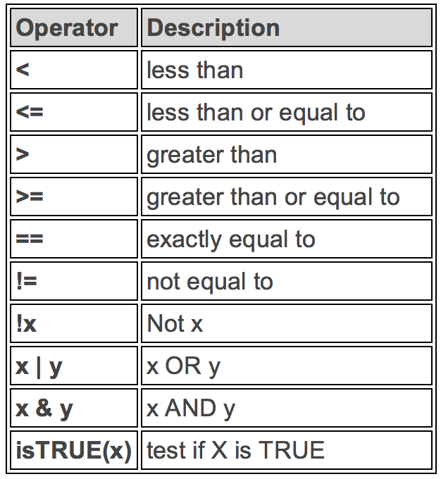

```{r setup, include=FALSE}
knitr::opts_chunk$set(echo = TRUE)

suppressWarnings(library(magrittr))
suppressWarnings(library(dplyr))
suppressWarnings(library(readxl))
suppressWarnings(library(tidyr))

setwd("C:/Users/oscar/Desktop/R --- SAF/Tema 3")

data <- read_excel("data.xlsx")
```


<style>
table {
background-color:#FFFFFF;
}
</style>

<style>
.list-group-item.active, .list-group-item.active:focus, .list-group-item.active:hover {
    background-color: darkblue;
}
</style>

<button onclick="document.body.scrollTop = document.documentElement.scrollTop = 0;" style="
    position: fixed;
    bottom: 5px;
    right: 40px;
    text-align: center;
    cursor: pointer;
    outline: none;
    color: #fff;
    background-color: #0A71A0;
    border: none;
    border-radius: 15px;
    
">Ir arriba</button>


El presente tema expone la transformación de los datos.  Se abordarán los puntos:

- La transformación y la carga.
- Los pipes.
- Verficar y cambiar los tipos de variables.
- Transformación del tipo de datos: crear, seleccionar, ordenar, agrupar, y otros elementos.
- Horientación de la data.
- Otros arreglos a la data.

Al finalizar la sesión se estará en completa capacidad para transformar cualquier archivo de datos, para próximamente analizar la información (tablas, gráficos, etc.). 

# De vuelta al ETL...

Habíamos definido el ETL como:

**E**xtract, **T**ransform and **L**oad es el proceso que permite mover datos desde múltiples fuentes, reformatearlos y limpiarlos, y cargarlos en otra fuente de análisis: base de datos, data mart, o data warehouse, para luego analizarlos y darle un valor a la información.


El tema anterior nos encargamos del proceso de *Extract* o de extracción de la data. Se presentará ante todo el proceso de Transformación. Se explicará en que consiste el proceso de Carga. 

## La transformación.

Entendemos por transformación una serie de arreglos o reglas  para los datos extraídos, para así convertirlos en datos que serán cargados y luego analizados. Normalmente, las fuentes primarias (archivos planos) requerirán manipulación de los datos para poder calsar con la representación de análisis deseado.

Algunos casos de transformación podrían ser:

- Seleccionar solo ciertas columnas.
- Traducir códigos (por ejemplo, si la fuente almacena una "H" para Hombre y "M" para Mujer pero el destino tiene que guardar "1" para Hombre y "2" para Mujer).
- Codificar valores libres (por ejemplo, convertir "Hombre" en "H" o "Sr" en "1").
- Obtener nuevos valores calculados (por ejemplo, total_venta = cantidad * precio, o Beneficio = PVP - Coste).
- Unir datos de múltiples fuentes (por ejemplo, búsquedas, combinaciones, etc.).
- Calcular totales de múltiples filas de datos (por ejemplo, ventas totales de cada región).
- Generación de campos clave en el destino.
- Transponer o pivotar (girando múltiples columnas en filas o viceversa).
- Dividir una columna en varias (por ejemplo, columna "Nombre: García López, Miguel Ángel"; pasar a tres columnas "Nombre: Miguel Ángel", "Apellido1: García" y "Apellido2: López").
- Entre otros.

Al finalizar la fase de transformación, manipulación de la data, poseemos el archivo  deseado para el futuro análisis.


## La carga

La fase de carga es el momento en el cual los datos de la fase anterior (transformación) son cargados en el sistema de destino. 

El presente curso no presente realmente la *carga*, dado que trabajamos siempre en nuetro "serviro local", lo cual sería nuestro ordenador. Sin embargo, si el archivo fuera trasladado a otra computadora, servidor, etc, entonces el viaje del archivo a otro sistema, una vez este finalizado y adaptado al otro entorno, eso sería la carga. 


# Los pipes. 

Antes de iniciar el contenido de la transformación de los datos, hagamos un paréntesis y expliquemos el funcionamiento de los **pipes** en R.

El uso de los pipes es una de tantas alternativas en la transformación y tratamiento de los datos. Los utilizaremos dado que facilita bastante el proceso de transformación y en sí de expresar código sencillo en R.

Al hacer uso de estos, sería bueno explicar qué son, de dónde provienen, cuándo utilizarlos y cuando **NO** utilizarlos.

### ¿Qué son los pipes?

Los pipes son una herramienta poderosa para expresan una secuencia de operaciones en diversas funciones. Se utilizan tanto en el tratamiento, trasformación y otros relacionados con la data, como lo son la presentación tabular y gráfica, por ejemplo.

R Studio define así los *pipes*.


## ¿De dónde provienen?

Provienen de tres corrientes de pensamiento y de aplicación:

- Matemática
- Informática
- Programación en R

Fue creado por Stefan Bache, y propuesta bajo para la librería de *magrittr*. Más adelante fue incorporado en la librería *dplyr* dado que *magrittr* es una dependencia de esta. 

¿Qué queremos decir con que *magrittr* es una dependencia de la librería *dplyr*?

Por ende, ¿qué entendemos por depedencia de una librería?

Para utilizar el pipe debemos, por lo tanto, utilizar alguna de las siguientes librerías

```{r }
suppressWarnings(library(magrittr))
suppressWarnings(library(dplyr))
```

Cargas las librerías, podemos utilizar el operador *pipe*.

```{r eval = FALSE}
%>%
```


## ¿Cómo funciona?

El operador  *pipe* es un desencadenador de comandos en uno o varias funciones en específico. Se podría decir que el operador es una forma de decir, a este objeto, realize esto, luego a este otro haga esto sabiendo que hizo aquello, y así consecutivamente. 

Para aclarar, veamos un ejemplo a partir del set de datos "data".

Recordemos un poco este set de datos.

```{r}
names(data)
head(data)
```

Vamos a manipular o hacer una pequeña transformación a nuestros archivo *data*. Veamos el uso de los *pipes* en la asignación de un nuevo archivo llama *datos*:

```{r }
datos <- data %>%
           filter(ingreso1 > 4000) %>%
           arrange(ingreso1) 

head(datos[,], n=10)
```

¿Qué fue lo que sucedió?

A partir del archivo **data**, filtramos todo el set de datos según la variable *ingresos1* donde solo los ingresos superiores a 4000 pueden figurar. Luego, ordenamos de menor a mayor el set de **datos** tomando la variable *ingresos* como referencia.

¿Cómo se debería leer o interpretar el uso del pipe? 

De la siguiente manera:

**bajo la asignacion de datos, primero tome el set "data", luego realice un filtro "ingresos1" > 4000, luego de esto realice un ordenamiento sabiendo o manteniendo en memoria lo anterior**

Una forma más expedita de explicarlo: 

**...tome el set datos, luego realice un filtro para  "ingresos1>4000", y luego ordene de menos a más por "ingresos".**

El uso del pipe %>% es una forma rápida y expedita de transformar, resumir y hacer diversas operaciones a la información. 

El proceso de tener una cadena estandarizada de acciones de procesamiento se le conoce como realizar **pipelines** a la data o a la información.

Veamos la siguiente definición de **pipelines**:

*Data pipelines enable the flow of data from an application to a data warehouse, from a data lake to an analytics database, or into a payment processing system, for example.* **Data pipelines also may have the same source and sink, such that the pipeline is purely about modifying the data set.**


## ¿Por qué utilizar los pipes?

R es un lenguaje funcional, lo que significa que su código a menudo contiene muchos argumentos dentro de su función, o dentro del paréntesis de la función **( )**. 

Cuando se posee un código complejo, esto a menudo significa que se tendrá que anidar diversos paréntesis **(...(( ))...)** para una solicitud determinada. 

Esto hace que  el código R sea muchas veces difícil de leer y comprender... 

¡Pero aquí es donde nuestros *pipes* **%>%** entra al rescate de nosotros! (... un poco polo pero la idea se endiende XD ...)

Veamos el siguiente ejemplo, el cuál explica el caso anterior:

```{r}
# Creamos el vector  "x"

x <- c(0.109, 0.359, 0.63, 0.996, 0.515, 0.142, 0.017, 0.829, 0.907)
```

Queremos para el vector x, el logaritmo de la diferencia exponenciada y redondeado al entero 1 más próximo. Aplicamos las siguientes funciones al vector *x*:

- round
- exp
- diff
- log

Para lo que requerimos, su expresión en funciones anidadas sería lo siguiente:

```{r}
round(exp(diff(log(x))), 1)
```

Puede llegar a ser complicado... dado que son muchas funciones anidadas entre sí. Además nótese que el ordenamiento de cada funciones debe ir con cuidado... controlar tantos paréntesis suele ser un trabajo molesto.

¡Con el uso uso del pipe se hace mucho más sencillo! 

Veamos la siguiente aplicación:

```{r}
library(magrittr)

x %>% log() %>%
    diff() %>%
    exp() %>%
    round(1)

```

Obtenemos los mismos resultados. 

También tenga en cuenta que **NO** es un requisito formal agregar los paréntesis después del *log*, *diff* y *exp*, pero, dentro de la comunidad de R, se prefiere ponerlos para aumentar la legibilidad del código.


Entre las principales razones para utilizar el pipe tenemos:

- Estructurará la secuencia de sus operaciones de datos de izquierda a derecha, como se indica desde adentro hacia afuera.
- Evitará hacer uso de funciones anidadas.
- Minimizará la necesidad de variables locales y definiciones de funciones.
- Facilitará agregar niveles o pasos en cualquier lugar de la secuencia de las operaciones.

## Cuándo no usar los pipes

El pipe (¿los pipes?) es (son) una herramienta poderosa, pero no es la única herramienta a disposición, y no resuelve todos los problemas... Los pipes son más útiles para reescribir una secuencia lineal de operaciones bastante cortas. Se deberían buscar otra herramienta cuando:

- Los pipes son más largos que, digamos, diez pasos. En ese caso, cree objetos intermedios con nombres significativos. Eso facilitará la depuración, ya que puede verificar más fácilmente los resultados intermedios y facilita la comprensión de su código, porque los nombres de las variables pueden ayudar a comunicar la intención.

- Existen múltiples entradas o salidas. Si no hay un objeto primario que se está transformando, pero dos o más objetos se combinan entre sí, no use la tubería.

- Está comenzando a pensar en un gráfico dirigido con una estructura de dependencia compleja. Las tuberías son fundamentalmente lineales y expresar relaciones complejas con ellas generalmente generará un código confuso.

No todo esto es del todo claro, pero está fuera de los propósitos del curso.

Para más imformación de los pipes, véase el siguiente enlace:

https://www.datacamp.com/community/tutorials/pipe-r-tutorial

# Transformación de los datos.

Ahora sí! Manos a la obra!

Adquirido el conocimiento sobre los *pipes*, volvemos a la *Matrix* para hacer todas las modificaciones que deseemos.


El proceso de transformación es muy amplio, y abarca temas como:

- Asignación correcta de las variables.
- Seleccionar las variables y casos necesarios.
- Crear nuevas variables.
- Imputación de los NA (valores perdidos).
- Cambiar la estructura u orientacion del archivo de datos.
- Entre otros....

En el presente tema trataremos de estudiar la mayor de herramientas que se suelen utilizar en la transformación de los datos.

Surgirá la pregunta: ¿por qué deberé comenzar?

Esa preguna es complicada de responder. Cada persona tiene su estilo y su forma de arreglar los datos. Una aproximación muy acertada es ver
qué procesos permite optimizar el proceso como tal, pero es algo que está fuera del contenido del presente curso.

El proceso de transformación se crea para, a partir de un archivo de datos, limpiarlo o transformalo, para luego obtener los partes que nos intereza. Por tanto deter un archivo totalmente restituido es vital para los análisis a venir.


# Cambiando el tipo de variable.

¿Recuerdan el proceso de importación de la clase anterior? ¿Recuerdan que habían variables que, a la hora de la importación, no recibián correctamente el tipo que realmente les correspondia?


Una etapa importante de la transformación y arreglo del archivo de datos, es corroborar que efectivamente los datos posean el tipo que les corresponde. Después de todo, los datos, nuestra matería prima, debe contener el valor que realmente les pertenece.

Se podrían preguntar: ¿pero no fue cubierto en la importar? La respuesta es un rotundo **SÍ**, pero muchas veces lo obviamos, y pues no toca transformarlo luego de la importanción de los datos. Por cierto, la opción de importar por el *ide* de R posee la opción de cambiar el tipo de variable, así como la sintaxis de importación de datos.

De igual manera, cuando no estamos  familiarizados con los datos, no nos queda de otra que hacer el arreglo luego de la etapa de la importación de la data. Veamos el caso de nuestro archivo llamado data.

```{r}
names(data)
suppressWarnings(data) 
```

¿Qué percibimos para las diferentes variables? ¿Todas están correctamente asignadas? 

Veamos la estructura del archivo data:

```{r}
str(data)
```

¿Cuáles son las variables que deberíamos entonces modificar?

## Tipos de variable

Antes de estudiar cómo es que modificamos el tipo de variables, veamos dos funciones útiles para corrobor el tipo de datos.

### La función class()

Mediante la función class() podemos ver qué es cada objeto: escalar, vector, matriz, archivo y aún más...

```{r}
class(data)
```

Y si, todo es **TODO**.

```{r}
class(data$Id)
class(data$fecha)
class(data$ingreso1)
class(data$ingreso2)
class(data$ingreso3)
class(data$ingreso4)
class(data$ingreso5)
class(data$Sexo)
class(data$Estadocivil)
class(data$Trabajador)
class(data$Nacionalidad)
class(data$Sangre)
class(data$logica)

```

### La familia de funcion "is.TIPO()"

Otra forma es mediante la familia de "is.TIPO()", por ejemplo **is.numeric()**, **is.character()**, etc.

Acá tenemos diversas modalidades:

```{r eval=FALSE}
is.array()
is.atomic()
is.call()
is.character()
is.complex()
is.data.frame()
is.na.data.frame()
is.double()
is.element()
is.environment()
is.expression()
is.factor()
#is.  --> y se despliega la lista entera
```

Veamos su uso:

```{r}
is.character(data$Id)
class(data$fecha)
is.character(data$Sexo)
is.character(data$Estadocivil)
is.character(data$Trabajador)
is.character(data$Nacionalidad)   
is.character(data$Sangre)
is.logical(data$logica)

```

El uso de la función "is.*TIPO*()" devuelve un valor lógico, y mediante los valores **TRUE** o **FALSE**, nos guía en la asignación correcta de las variables. 

## Cambiando las variables

Ahora que sabemos que debemos trabajar con la asignación correcta de cada columna (o su tipo), existen dos formas de modificar las variables según el tipo que les corresponda:

- Método clásico
- Utilizando el dplyr

Veamos ambas modalidades

### A la antigua...

La primera era utilizando una función llamada  "as.*TIPO*()". Por ejemplo **as.numecir()**, o **as.character()**.

Veamos esto traducido a código R.

```{r}
data
class(data$Id)

#as.character(data$Id)
class(as.character(data$Id))

data$Id = as.character(data$Id)

tail(data)
class(data$Id)

```

Utilizamos dos elementos : la función *as.characte()* (**derecha**), y la referencia a la variable que debemos cambiar (**izquierda**).

Otro aspecto interesante es que **NO** utilizamos el signo "*<-*" si no el "**=**" Resulta que podemos crear escalares, matrices , vectores y otros con el signo "=", pero lo recomdable es utilizar el signo "**=**" en espacio de condicionamiento o de asginación exclusiva, como es el caso. 

¿Por qué decirmos asignación exclusiva? ... 

¿Qué hubiera pasado si en vez de usar "**=**" utilozamos el signo "<-" ? Eso lo deben probar por aparte.

Hay diversas funciones "as.*TIPO*()":

```{r eval=FALSE}
as.array()
as.character()
as.Date()
as.factor()
as.null()
as.numeric()

```


## Mediante el uso del dplyr 

Podemos modificar los tipos de variables mediante las siguientes funciones del dplyr:

- mutate: crea una variable función.
- transmutate: re escribe la variable.

Especificado esto, igualemente volveríamos a la forma vista anteriormete de:  

```{r eval=FALSE}
datos$variable = as.TIPO(datos$variable)
```

Cuando estemos en la sección de Transformación de variables --> Creando nuevas variables, veremos las modalidas comentadas.

------------------------------------------------------------------------------------------------------------------------

# Operadores condicionales.

Antes seguir estudiante otras formas de transformar la información, se debe explicar los tipos de **Operadores condicionales**.

En la definición y transformación de los datos, necesitaremos utilizar ciertos operadores. Una lista de los más utilizados:

 
Veremos luego como aplicamos varios de estos operadores. 

# Transformación de los datos.

Al analizar la información, gran parte del tiempo se consume en arreglar el archivos de datos. Procesos tales como filtrar, ordenar, eliminar, crear nuevas variables, etc., son catalogadas como proceso de transformación.

Además de la correcta asignación de variables, podemos tener tres grandes tipos de transformación:

- Para las varibles (columnas).
- Para los casos (líneas).
- Para todo el archivo de datos (rectángulos).

Presentaremos estos casos. 

Utilizaremos para esto la librería de **dplyr** de R.

```{r eval=FALSE}
library(dplyr)
```

  

## Manipulando casos

Al manipular casos, algunas de las funciones que podríamos uilizar son:

- **filter**: filtra o extrae cierta casos según algún criterio condicional
- **distinct**: elimina columnas con casos duplicados
- **sample_frac**: de forma aleatoria selecciona según la fracción un número de casos
- **sample_n**: de forma aleatoria selecciona una muestra de tamaño n de casos
- **slice**: selecciona casos o columnas según la posición
- **arrange**: ordena los casos según algún criterio 
- **add_row**: permite agregar uno o más casos al archivo de datos

Las funciones **mutate()** y **transmutate()** tendrán un apartado especial, cuando veamos la creación de varibles.

Veamos las funciones más representativas.

### Filter()

```{r}
dim(data)

# solo por esta ver haremos una asignación

a <- data  %>%
     dplyr::filter(data$Sexo=="M")

dim(a)

b <- data  %>%
     dplyr::filter(data$ingreso1>6000)

dim(b)
```

### distinct()

```{r}
#Opción 1
 data  %>%
     dplyr::distinct(data$Sexo)

```


### sample_frac()

```{r}

dim(iris)

c <-  sample_frac(iris, 0.5) # opción replace=TRUE o replace=FALSE
dim(c)

    ```


### sample_n()

```{r}
dim(iris)
d <- sample_n(iris, 30) # opción replace=TRUE o replace=FALSE
dim(d)

```

### slice()

```{r}
dim(iris)

e <- slice(iris,40:90)
```


### El arrange()  

El arrange o el ordenamiento puede hacer tanto ascendente (de menos a más) o descendente (de más a menos), además se pude ordenar por diversas variables.

```{r}
f1<- data  %>% 
     dplyr::arrange(data,ingreso1)

f2<- data  %>%
    dplyr::arrange(data,desc(ingreso1))

f3 <- data  %>%
    dplyr::arrange(data,desc(ingreso1),ingreso2)

```

## Manipulando variables - columnas

Otra transformación fundamental es a nivel de las variables. Algunas de las funciones que se podrían utilizar son:

- **pull**: extrae los valors de la columna como si fue un vector. No extrae la columna de forma entera.
- **select**: selecciona la columna o variable.
- **rename**: le brinda otro nombre a la variable.
- **add_column**: agrega una columna.

Veamos un poco los usos a partir del archivo de datos *mtcars*:

```{r}
mtcars
names(mtcars)

```

### pull()

```{r}
mtcars %>% 
     pull(var = cyl)

mtcars %>% 
        select(cyl)

```

¿En dónde radica la diferencia entre el *pull()* y el *select()* ?

### select()

```{r}
mtcars %>%
        dplyr::select(cyl)

mtcars %>%
        dplyr::select(cyl,disp,hp)
```

### rename() 

```{r}
names(mtcars)

g <- mtcars %>%
        dplyr::rename(
          `Millas por galon`      = mpg,
          `Número de cilindros`   = cyl,
          `Caballos de fuerza`    = hp
        )

names(g)

```

¿Qué son los `` utilizados?


## Creando nuevas variables

Al crear nuevas variables solemos utilizar las funciones *mutate* y *transmutate*: 

- **mutate**: crea una nueva variable, sin elminar las otras. 
- **transmutate**: re escribe una variable y además elimina las demás variable 

Veamos unos ejemplos:

### La función mutate

```{r}
dim(mtcars)
names(mtcars)

h <- mtcars %>%
         mutate(
             cyl_reloaded = cyl+4,
             mpg_reloaded = mpg/2
             
         )

dim(h)
names(h)
h[,c("cyl_reloaded","mpg_reloaded")]
    
```

### La función transmutate

```{r}
dim(mtcars)
names(mtcars)

h2 <- mtcars %>%
         transmute(
             cyl_reloaded = cyl+4,
             mpg_reloaded = mpg/2
             
         )

dim(h2)
names(h2)
h2[,c("cyl_reloaded","mpg_reloaded")]

```

Como se dijo, mientras que *mutate* crea una nueva variable, *transmutate* le cae encima a una variable ya existente. 
 
## Creando variable con condiciones.

La creación de variables a través de los condicionamiento se puede dar tanto para variables numéricas como caracteres, de igual forma, la variable creada puede tener alguna de las anteriores asignaciones.

Veamos algunos casos: 

### Variable caracter

```{r}
iris  %>% 
    dplyr::distinct(Species)


    i1 <- iris  %>% 
              dplyr::mutate(
                  case_when(
                      `Species`== "setosa" ~ "Setosa",
                      `Species`== "versicolor" ~ "Versicolor",
                      `Species`== "virginica" ~ "Virginica"
                  )
              )%>%
              dplyr::rename(
                 `Species_2`      = `case_when(...)`
              )

names(i1)
head(i1)

```

Es usual, luego de crear una variable, renombrarla y utilizar la función *rename()*.

```{r}
 i2 <- iris  %>% 
              dplyr::mutate(
                  case_when(
                      `Species`== "setosa" ~ 134,
                      `Species`== "versicolor" ~ 345,
                      `Species`== "virginica" ~ 675
                  )
              )%>%
              dplyr::rename(
                 `Species_2`      = `case_when(...)`
              )

names(i2)
head(i2)

```

### Variable numérica.

```{r}
mtcars

j1 <- mtcars %>% dplyr::mutate(
                  case_when(
                      hp <= 100 ~ "Bajo",
                      hp > 100 | hp <= 120 ~ "Medio",
                      hp > 121 ~ "Alto"
                    )
              )


j1 <- j1 %>%
          dplyr::rename(
                         `hp reloaded` = `case_when(...)`
              )
               
j1[,c('hp',"hp reloaded")]

```

```{r}
mtcars

j2 <- mtcars %>% dplyr::mutate(
                  case_when(
                      hp <= 100 ~ 1000,
                      hp > 100 | hp <= 120 ~ 2500,
                      hp > 121 ~ 3467
                    )
              )


j2 <- j2 %>%
          dplyr::rename(
                         `hp reloaded` = `case_when(...)`
              )
               
j2[,c('hp',"hp reloaded")]

```

Mediante las funciones mutate() y transmutate() se pueden crean un sin fin de variables: rezagos (**lag()**), diferencias, rangos, porcentajes, etc... 

## Agrupando los casos

Es común agrupar o agregar los casos según cierto criterio : año,  institución, por sector de trabajo, etc.

El agrupamente casi siempre está acompañado por una medida de resumen, las cuales veremos justo después del agrupamiento. 

La función que utilizaremos es **group_by**.

```{r eval=FALSE}

mtcars

mtcars %>%
     group_by(cyl)

```

Ahora para que la función tenga algún sentido, debe ser utilizada conjuntamente por una medidas o estadísticos de resumen como el 
promedio, la suma, el mínimo, máximo, etc.

Veamos el promedio agrupando por tipo de cilindros 

```{r}
mtcars %>%
     group_by(cyl) %>%
     summarise( `Promedio` = mean(mpg))

```

¿Qué fue lo que sucedó en este proceso? 

¿cuáles son las dos partes esenciales para llegar a obtener dichas tablas?

## Resumiendo los casos

Vamos adelantar un poco el fin del proceso de transformación, pero esto con el fin de que la función *group_by* tengo un sentido dentro de la etapa de transformación

Recordemos un poco justificación de la transformación:


Una vez arreglado o trasformado nuestro archivo de datos, puede que nos interese únicamente cierta o ciertas informaciones de la tabla restituida. Las tablas dinámicas nacen para dicho propósito: busco resumir la información que exclusivamente me sirve. Pues, todo el componente antes visto (más otros elementos de más adelante....) + la función de resumen o "**summarise()**" del *dplyr* buscan lo anterior. Solamente que con más opciones, rapidez y flexibilidad que una table dinámica....

Veamos la estructura de la funcion summarise():

```{r eval=FALSE}

dplyr::summarise("var.1" = function(x),
                 "var.2" = function(y),
                 etc
                )

```

La función **summarise()** debe especificar primero la o las columnas que queremos crear ("var.1" y "var.2"), y luego someter mediante el operador "=" el tipo de cálculo u operación que deseamos realizar.

¿Cuáles serían las principales funciones que nos podrían interesar?

Mediante las funciones de resúmenes podemos obtener:

- *Agregación*: sum()
- *Centralidad*:  mean(), median()
- *Rango*: min(), max(), quantile()
- *Position*: first(), last(), nth()
- *Conteo*: n(), n_distinct()
- *Logicos*: any(), all()
- *Valores temporales*: lag(), diff().

También, la opción de **summarise()** nos permite realizar cálculos tomando en cuenta la presencia de *VA* o valores faltantes para la variable de interés. 

Dentro de la función de interés, por ejemplo "sum()", debemos indicar "na.rm = TRUE" como segundo argumento.

Veamos un ejemplo

```{r eval=FALSE}
data %>%
  group_by(lgID) %>%
  summarise(sum_homerun_league = sum(HR,na.rm = TRUE) )
```

¿Qué nos indica el código anterior?

Finalmente, cuando utilizamos la funcíón *summarise* se crea una tabla solitaria con la estadística de la suma de de la variable HR agrupada por *lgID*  

Veamos algunas aplicaciones a partir de la función **summarise()**.

### Salarios minimos 

```{r}
data %>%
  summarise (min1 = min(ingreso1,na.rm = TRUE)
             )
```

### Salarios máximo

```{r}
data %>%
  summarise (max2 = max(ingreso2,na.rm = TRUE)
             )
```


### Promedio en ingresos

```{r}
data %>%
  summarise (prom1 = mean(ingreso1,na.rm = TRUE),
             prom2 = mean(ingreso2,na.rm = TRUE),
             prom3 = mean(ingreso3,na.rm = TRUE),
             prom4 = mean(ingreso4,na.rm = TRUE),
             prom5 = mean(ingreso5,na.rm = TRUE)
             )
```

### Conteo por sexo

```{r}
data %>%
  dplyr::group_by(Sexo) %>%
  dplyr::summarise ('Conteo' = n()
      )

```

### Suma de salario por año

```{r}
data  %>%
  dplyr::group_by(ano) %>%
  dplyr::summarise("Monto totales1" = sum(ingreso1, na.rm = TRUE),
              "Devengado" = sum(ingreso2, na.rm = TRUE),
             "Ajustado" = sum(ingreso3, na.rm = TRUE)
                  )
```

## Diversas manipulaciones

Al utilizar las diferentes funciones del **dplyr** podemos hacer todo lo que queramos. Veamos un caso un tanto más complejo que los anteriores.

```{r}
data %>%
  filter(Sexo=="M") %>%
  group_by(Nacionalidad) %>%
  summarise( 'Ingresos' = sum(ingreso1,na.rm = TRUE)) %>%
  arrange(desc(Ingresos))

```

Haciendo uso del pipe *%>%* y de las demás funciones, podemos llegar a formar el archivo de datos que deseemos. Luego, el **summarise()** nos permite obtener obtener la consulta exacta que deseamos.

Considero que la función **group_by** siempre va acompañada de un **summarise()**. 

## Las variables caracter 

Las variables tipo *caracter* tienen un trato especial en lo que a la transformación  de datos se refiere. Dentro de la familia de librerias **Tidyverse**, existen dos librerías dedicadas tanto al análsis como transformación de los datos:

- forcarts


- stringr


De igual forma, hay ciertas funciones caracter del paquete dplyr que nos ayudan a tratar nuestra data. Las más comunes son:

- **paste()** : concatena tanto objetivos character, así como variables y otros. 
- **substr()**: su forma es "substr(x, starting position, end position)" y sirva para extraer elementos
- **nchar()**: nos dice el tamaño de la variable character
- **sub()**: su forma es " sub(sub-string, replacement, x, ignore.case = FALSE)" y reemplaza la primera coincidencia de la cadena
- **tolower()**: todo a minúscula
- **to upper()**: todo a mayúscula
- **timws()**: se utiliza para eliminar espacios iniciales y / o finales.
- **clean()**: convertir múltiples espacios en un solo espacio.
- **strrep()**: ripete los caractéres N veces

Una lista bastante completa se puede consultar en el siguiente enlace: http://uc-r.github.io/characters

Veamos algunos ejemplos.

### paste()

```{r}
x <- "Deepanshu"
y <-"Bhalla"
paste(x, y)

paste(x, y, sep = ",") 
paste("x", seq(1,10), sep = "")
paste("x", seq(1,10), sep="", collapse=",")

```

### substr()

```{r}
x <- "abcdef"
substr(x, 1, 3)

```

### nchar()

```{r}
x <- "Yo amo programar en R. R es TODA!"
nchar(x)
```

### sub()

```{r}
sub("todo bien", "ok", "Creo que todo bien en este código")
```
### tolower()

```{r}
x <- "Vayamos al cine a un Mall. No. no podemos. Además no tenemos dinero."
tolower(x)

```

### toupper()

```{r}
x <- "Vayamos al cine a un Mall. No. no podemos. Además no tenemos dinero."
toupper(x)
```

## Combinando las tablas.

Aunque existe un lenguaje para modificar, pegar y arreglar los datos cuando estos provienen de 2 o más tablas, el **SQL** (*Structured Query Language*), *dplyr* posee diversas funcionalidades para cubirir someramente los casos donde se quieren combinar dos tablas de datos. 


## Ir aún más allá...

Es posible que se lleguen a enfrentar a casos donde las funciones existentes no pueden arreglar o transformar nuestros datos. Cuando esto suceda, nos debemos referirse a las *expresiones regulares*...


# Reformando los datos.

Es posible que la forma de nuestros datos no sea la deseable para proceder con los análisis. También, nuestro archivo podría estar plagado de NA, y, la columna como tal posee, en realidad, dos variables y un separador o simbolo cualquiera.

Veremos unos últimos casos de transformación de los datos.

## Reformar la horientación del archivo de datos.

Reformar la tabla, o hacer un *reshape*, cambia la orientación de los valors de una tabla. Existen dos tipos de orientación en una tabla:

- Horizonal 
- Vertira

Si queremos pasar de vertiral a horizontal, debemos de realizarlo mediante un **gather()**.


Si queremos pasar de horizontal a vertical, debemos de utilizar un **spread()**.


Veamos cada uno

### El gather()

La función **gather()** posee la siguiente estructura:

```{r eval=FALSE}
gather(
  data,
  key = "key",
  value = "value",
  ...,
  na.rm = FALSE,
  convert = FALSE,
  factor_key = FALSE
)
```

Veamos una aplicación:

```{r}
datos <- tibble(
  time = as.Date('2009-01-01') + 0:9,
  Ejecutado = rnorm(10, 0, 1),
  Ajustado = rnorm(10, 0, 2),
  Inicial = rnorm(10, 0, 4)
)

datos

# Forma 1

gather(datos, "presupuestos", "valores", -time)

# Forma 2

datos %>% gather("stock", "price", -time)

```

### El spread()

La función **spread()** posee la siguiente estructura:

```{r eval=FALSE}
spread(
  data, 
  key, 
  value, 
  fill = NA, 
  convert = FALSE, 
  drop = TRUE,
  sep = NULL)
```

Veamos una aplicación:

```{r}
stocks <- data.frame(
  time = as.Date('2009-01-01') + 0:9,
  X = rnorm(10, 0, 1),
  Y = rnorm(10, 0, 2),
  Z = rnorm(10, 0, 4)
)

stocks

stocksm <- stocks %>% gather(stock, price, -time)

stocksm %>% spread(stock, price)
```

Veamos como ir de un gather() a un spread()

```{r}

#gather
stocksm <- stocks %>% gather(stock, price, -time)


#spread
stocksm %>% spread(stock, price)
```

Veamos otra forma como podemos modificar el sentido de la tabla.

```{r}
stocksm %>% spread(time, price)
```

Finalmente, las funciones **gather()** y **spread()** son complementarias. Se puede modicar el archivo de datos de un lado a otro. 

Una referencia de la orientación de los datos, y sus dos funciones, es lo siguiente:


## Tratando los NA

Los **NA** o valores perdidos, siempre, siempre, ..., siempre, serán un fastidio. Vimos que la función **summarise()** posee una forma de lidear con ellos, pero también se puede hacer frente  modificando sus valores en el archivos de datos. Tres forms de manejar los **NA** o valores perdidos:

- **drop_na()**: elimina los **NA**. El problema es que al elimiar el **NA**, se eliminará la fila entera.
- **fill()**: rellena el **NA** con el valor más próximo arriba u abajo. Su forma es "fill(data, ..., .direction = c("down", "up", "downup", "updown"))"
- replace_na(): remplace el **NA** por una valor. Su forma es "replace_na(data, replace, ...)"

Veamos algunos ejemplos 

### drop_na()

```{r}
library(tidyr)
df <- tibble(x = c(1, 2, NA), y = c("a", NA, "b"))
df

df %>% drop_na()
```

### fill()

```{r eval=FALSE}
fill(data, ..., .direction = c("down", "up", "downup", "updown"))
```


```{r}
sales <- tibble::tribble(
  ~quarter, ~year, ~sales,
  "Q1",    2000,    66013,
  "Q2",      NA,    69182,
  "Q3",      NA,    53175,
  "Q4",      NA,    21001,
  "Q1",    2001,    46036,
  "Q2",      NA,    58842,
  "Q3",      NA,    44568,
  "Q4",      NA,    50197,
  "Q1",    2002,    39113,
  "Q2",      NA,    41668,
  "Q3",      NA,    30144,
  "Q4",      NA,    52897,
  "Q1",    2004,    32129,
  "Q2",      NA,    67686,
  "Q3",      NA,    31768,
  "Q4",      NA,    49094
)

sales %>% fill(year)

```

```{r}
tidy_pets <- tibble::tribble(
  ~rank, ~pet_type, ~breed,
  1L,        NA,    "Boston Terrier",
  2L,        NA,    "Retrievers (Labrador)",
  3L,        NA,    "Retrievers (Golden)",
  4L,        NA,    "French Bulldogs",
  5L,        NA,    "Bulldogs",
  6L,     "Dog",    "Beagles",
  1L,        NA,    "Persian",
  2L,        NA,    "Maine Coon",
  3L,        NA,    "Ragdoll",
  4L,        NA,    "Exotic",
  5L,        NA,    "Siamese",
  6L,     "Cat",    "American Short"
)

tidy_pets %>%
  fill(pet_type, .direction = "up")

```

```{r}
squirrels <- tibble::tribble(
  ~group,    ~name,     ~role,     ~n_squirrels,
  1,      "Sam",    "Observer",   NA,
  1,     "Mara", "Scorekeeper",    8,
  1,    "Jesse",    "Observer",   NA,
  1,      "Tom",    "Observer",   NA,
  2,     "Mike",    "Observer",   NA,
  2,  "Rachael",    "Observer",   NA,
  2,  "Sydekea", "Scorekeeper",   14,
  2, "Gabriela",    "Observer",   NA,
  3,  "Derrick",    "Observer",   NA,
  3,     "Kara", "Scorekeeper",    9,
  3,    "Emily",    "Observer",   NA,
  3, "Danielle",    "Observer",   NA
)

squirrels %>%
  dplyr::group_by(group) %>%
  fill(n_squirrels, .direction = "downup") %>%
  dplyr::ungroup()
```

### replace_na()

```{r}
df <- tibble(x = c(1, 2, NA), y = c("a", NA, "b"))
df

df %>% 
  replace_na(list(x = 0, y = "desconocido"))


```

## Separadores es una columna

Una columna puede realmente contener más de dos variable, y un separador es el que se interpone en la correcta definición de esta.

Podemos utilizar las funciones de separación para esto:


# Al finalizar la transformación de los datos...

Volvamos a esta imagen:


Finalizado el proceso de transformación de los datos es que solemos hacer las consultas de la información que deseamos. Es como una tabla dinámica: esta se alimenta de un archivo para así saber la información requerida. En este caso, recurrimos al **summarise()** para así obtener la data de interés.

# Sitios de referencias 

https://dplyr.tidyverse.org/

https://tidyr.tidyverse.org/

https://www.guru99.com/r-aggregate-function.html

https://www.datacamp.com/community/tutorials/pipe-r-tutorial

https://rsanchezs.gitbooks.io/rprogramming/content/chapter9/summarise.html

https://r4ds.had.co.nz/


