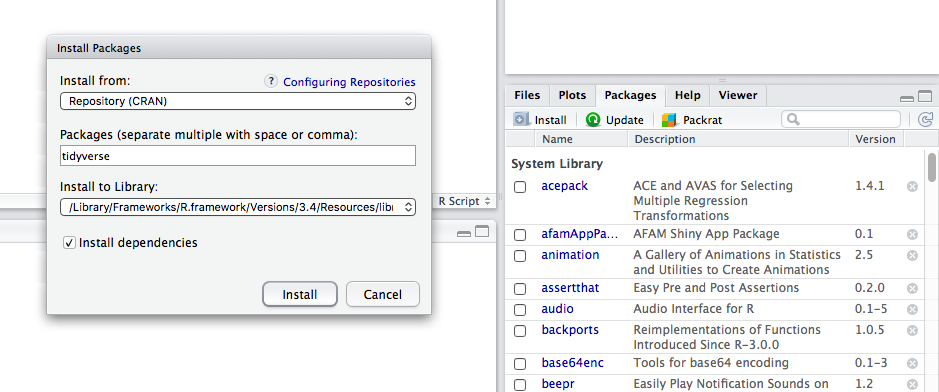

```{r setup, include=FALSE}
knitr::opts_chunk$set(echo = TRUE)

```

<style>
table {
background-color:#FFFFFF;
}
</style>

<style>
.list-group-item.active, .list-group-item.active:focus, .list-group-item.active:hover {
    background-color: darkblue;
}
</style>

<button onclick="document.body.scrollTop = document.documentElement.scrollTop = 0;" style="
    position: fixed;
    bottom: 5px;
    right: 40px;
    text-align: center;
    cursor: pointer;
    outline: none;
    color: #fff;
    background-color: #0A71A0;
    border: none;
    border-radius: 15px;
    
">Ir arriba</button>

# {.tabset .tabset-fade .tabset-pills}


El presente tema buscar introducir a las personas tanto en el lenguaje de programación R y su ide (integrated development environment) o programa de interfaz R-Studio.  Se abordarán los puntos:

- Interface del R-Studio.
- Las paquetes y librerías en R.
- Tipos de variables. 
- Operaciones. 
- Objetos de análisis.

Al finalizar la sesión, se tendrá una idea clara del R Studio, su funcionamiento, y la forma en que la información 
se suele restituir para el procesamiento, análisis y presentación de la misma. 


## Instalar R y R-Studio {.tabset .tabset-fade .tabset-pills}


#### Instalando los programas...

Lo primero que se debe hacer es instalar el R y el R-Studio:

R: https://cran.r-project.org/bin/windows/base/

R-Studio: https://rstudio.com/products/rstudio/download/

Primeramente se instala el R, y seguidamente el R-Studio.

## Interface del R-Studio {.tabset .tabset-fade .tabset-pills}


### ¿Qué es el R y el R-Studio? 

R es un lenguaje de programación derivado del lenguaje de programación C y C++ que busca ejecutar ciertas instrucciones a partir de un razonamiento matricial. Años después se crea el R Studio, el cual es una aplicación más elegante, llamativa y flexible en la labor del manejo de la data o la información. 

#### Ejemplo de la interfaz del R-Studio


#### ¿Qué tipo de labor se realiza en R y R-Studio?

En una primera instancia, las labores constituidas en R se originan en un dominio de análisis de la información (analítica). En la actualidad también se pueden realizar otros procesos como:

- Ingeniería de datos.
- Analítica.
- Reporteo.
- Automatización.
- Ejecutar y conectar con otras plataformas mediantes APIs
- Entre otras de acciones...

#### ¿Por qué deberíamos aprender R? 

- R no implica mucho "apuntar" y hacer "click", y eso es algo muy bueno...
- El código R es excelente para la reproducibilidad.
- R es interdisciplinario y extensible.
- R funciona en datos de todas las formas y tamaños.
- R produce gráficos de alta calidad.
- R no solo es libre, sino que también es de código abierto y multiplataforma.

### ¿Cómo funciona el R Studio? 

#### Los cuadrantes del R-Studio. 

R Studio se divide en 4 paneles o cuadrantes:

- La Fuente para los scripts o códigos y documentos (arriba a la izquierda, en el diseño predeterminado),

- La consola R (abajo a la izquierda),

- El entorno / historia (arriba a la derecha), y

- Los archivos / parcelas / paquetes / ayuda / visor (abajo a la derecha), etc.


#### La Fuente

Aquí es donde toda la magia sucede!

Al abrir R esta se presenta de forma automática, sino podríamos acceder de la siguiente forma:

- Archivo --> nuevo archivo --> Script de R 
- Presionamos las teclas Ctrl + Shift + N


En la sección de *Fuente* editamos el código para el análisis. Nótese que podemos abrir más de una pestaña de códido. Cada pestaña representa un archivo de script o código R diferente. 

#### La consola

Aquí R imprime la salida de su código cuando se ejecuta. También puede escribir código directamente en la consola después del símbolo ">"


#### El entorno / historia

Este panel generalmente tiene las siguientes dos pestañas:

- Entorno: muestra todos sus datos, variables y funciones definidas por el usuario. El usuario los crea en el editor de código o directamente en la consola.

- Historial: una lista del historial de comandos.

Existen también las pestañas de "Connections" y "Tutorial", pero no serán abordadas. 


#### Archivos / parcelas / paquetes / ayuda 

Este panel contiene numerosos paneles útiles:

- **Archivos** : la lista de todos los archivos contenidos en su actual  directorio de trabajo. También puede navegar a diferentes carpetas en su computadora. Aquí es donde puede hacer click en diferentes scripts R para abrirlos en el editor de código.

- **Gráficos** : cuando se producen gráficos acompañados el código, estos se mostrarán en esta pestaña.

- **Paquetes** : la lista de paquetes (grupos de funciones) actualmente instalados en su computadora. Puede instalar paquetes nuevos o actualizar paquetes existentes desde esta pestaña haciendo clic en Instalar o Actualizar.

- **Ayuda** :  puede buscar en la documentación de R para obtener socorro con las diferentes funciones de R. ¡Esta es una característica muy útil de R Studio! También puede obtener ayuda para una función escribiendo "?" seguido del nombre de la función en la consola (por ejemplo, "?data.frame()" ).


### Antes de iniciar...

#### La ubicación de la sesión: el directorio de trabajo.

El directorio de trabajo es un concepto importante en R, y en la programación en general. Se refiere al directorio o carpeta actual en el que se está trabajando. Básicamente, R requiere que le se le indique en qué parte del sistema de la computadora debe comenzar a buscar los archivos, imágenes, etc. 

Esto es importante dado que el código, 99.9999% de las veces, utilizado cargas de datos y / o información, además al guardar modificaciones o exportaciones.  Estas también deben ser referenciadas en el directorio de trabajo.

Para saber dónde estamos ubicados, utilizamos la funcion "getwd()" : get working directory.

```{r}
getwd()
```

Si deseamos cambiar el director de trabajo, tenemos 3 opciones:

- Utilizar la funcion setwd("/dir/"), y el "/dir/" especficamos el camino de la carpeta de trabajo:

```{r}
setwd("C:/Users/oscar/Desktop/R --- SAF/Tema 1")
```

- Especificarlo a partir de la barra de opciones de R: --> Session -->  Set Working Directory --> Choose Directory


- Precionamos las teclas : CTRL + Shift + H , y seleccionar la carpeta de trabajo.

Si desean corroborar el cambio de directorio, se podría utilizar la función "getwd()".

#### El "ENCODING" o la codificación. 

La codificación le indica a la computadora cómo debe interpretar la lectura de las variables o las etiquetacas que sean "caracteres". Por lo general, por estar en América Latina deberíamos utilizar un encoding o codificación tipo UTF-8. Esto lo deberíamos seleccionar tanto a la hora de:

- Realizar la re apertura de un documento: --> File --> Reopen with Encoding...
- Cuando se guarda un documento: --> File --> Save with Encoding...


#### La visualización de la interfaz o del ide en R Studio.

¿No creen que el blanco encandila bastante? 

Tras largas horas de trabajo, prefiero tener un fondo negro o uno un tanto más opaco. 

Para esto vamos a : --> Tools --> Global Options --> Appearance 


#### Ejecutar el código

Más adelante, para la ejecución del código R podemos proceder de dos formas:

- Ejecutar seleccionando el código de presionar el botón de "RUN".
- Ejecutar seleccionando el código y presionar las teclas  CRTL + ENTER.

En el código los signos de "#" significan un comentario, y este no será compilado en el lenguaje de R.  

¿Cuál sería la diferencia entre ejecucción y compilación?

## Los Paquetes {.tabset .tabset-fade .tabset-pills}


Antes de abordar los paquetes, debemos explicar previamente el uso de las funciones en R. 

### ¿Qué es una función en R?

En R, una función es un objeto, por lo que el intérprete de R puede pasar el control a la función, junto con los argumentos que pueden ser necesarios para que la función realice las acciones. La función a su vez realiza su tarea y devuelve el control al intérprete, así como cualquier resultado que pueda almacenarse en otros objetos.

¿Quedo claro? Creo que no... 

Veamos 3 ejemplos de funciones:

#### Medidas de temperatura

```{r}
fahrenheit_to_celsius <- function(temp_F) {
  temp_C <- (temp_F - 32) * 5 / 9
  return(temp_C)
}

fahrenheit_to_celsius(32)

fahrenheit_to_celsius(212)
```

#### Cuadraro de la suma de valores:

```{r}
new.function <- function(a) {
   for(i in 1:a) {
      b <- i^2
      print(b)
   }
}

new.function(5)
```

¿Cuál es el efecto de especificar el escalar **5**?

#### Sumatoria de los elementos

```{r}
#Funcion con varios argumentos
new.function <- function(a,b,c) {
   result <- a * b + c
   print(result)
}

new.function(5,3,11)

new.function(a = 11, b = 5, c = 3)
```

¿Vieron que ahora tenemos 3 argumentos en vez de 1?

Por lo tanto, una función en R es un código que devuelve al usuario una respuesta determinada. 

La utilidad es que no hay que volver a escribir *n* veces el código, dado que este se guardo en la función, y por tanto solo se debe especificar el o los argumentos de la función. 

En el uso de R, practicamente el 99.99999999999% de nuestro código está fundamentado a través de funciones... 

Vista las funciones, podemos hablar de los paquetes.

### ¿Qué es un paquete en R?

Los paquetes son un agregado de funciones que están diseñados o creados para aplicarse a una determinda tarea: cambiar el tipo de dato, estandarizar fechas, importar /leer / escribir / exportar archivos de datos, hacer un análisis de regresión, series de tiempo, visualización tabular o gráfica, etc. 

En R utilizamos a partir de los paquetes una gran cantidad de funciones para poder llevar a cabo nuestras labores. Los paquetes son guardados en nuestro sistema de R en algo que denominamos como las librerías.

Si deseamos hacer uso de algunas de las funciones de un determinado paquete, entonces tenemos que llamar a la librería correspondiente, la cual tiene el mismo nombre del paquete. 

Otra definición bastante atinada de un paquete en R es la siguiente:

"*R packages are a collection of R functions, complied code and sample data. They are stored under a directory called  library in the R environment. By default, R installs a set of packages during installation. More packages are added later, when they are needed for some specific purpose.*"

Y pues si, en los paquetes además de funciones puede haber archivos de datos y otros elementos. 

Existen dos formas de instalar los paquetes en R:

- A partir del ide o interfaz del R-Studio, en la cuadrante de derecha-inferior.


- A partir de código --> utilizamos la función **install.packages()**

#### Instalando un paquete a partir del ide del R-Studio. 

Para instalar un nuevo paquete, haga clic en el botón "Instalar" ubicado debajo de la pestaña "Paquetes" en RStudio. Esto abrirá una ventana emergente donde puede buscar e instalar paquetes R alojados en CRAN. Alternativamente, si conoce el nombre del paquete que desea instalar, puede escribir el nombre.



De igual forma el ide de R le aportar una ayuda al aproximar el nomber del paquete.

Algo que debemos mencionar es que hay funciones que no están directamente en esta alternativa, y debemos de pasar por la instalación de paquetes mediante el código.

#### Instalando un paquete a partir de código. 

Ya sea en la Fuente o en la Consola, utilizando la función **install.packages()** y el nombre el paquete. Así se puede entonces instalar el paquete deseado:

```{r}
# install.packages("zoo")
```

NOTA: es un curso introductorio, pero muchas veces se suelen utilizar los argumentos de "dependencies=", "source=" y "repository=" para llamar a ciertas comandos especiales del paquete. 

También, **CRAN** no es el único repositorio de paquetes en R: el equipo o la compañía  de R-Studio tiene sus paquetes y actualizaciones en Github...

### Llamando a un paquete de R.

Finalmente, para utilizar las funciones, datos u otros de un determinado paquete, solemos utilizar la función *library()* y el nombre del paquete. Veamos su expresión en código R:


```{r warning=FALSE}
library(zoo)
```

#### El Top de los paquetes más utilizados en R.

Acá les dejo unos enlaces con los paquetes más utilizados en R:

- https://towardsdatascience.com/top-r-libraries-for-data-science-9b24f658e243
- http://makemeanalyst.com/20-most-popular-r-packages/
- https://www.kdnuggets.com/2015/06/top-20-r-packages.html
- https://www.journaldev.com/36488/top-best-r-packages


### Funciones, paquetes y datos integrados a R.

Dentro del entorno de R, este posee ciertas funciones, paquetes y datos internos al sistema. 

Por ejemplo, la función *library()* está integrada a R, al igual que la funciones *mean()*, *head()*, *tail()*, así como los sets de datos de **iris** y de  **mtcars**. 

Veamos algunos ejemplos:

```{r}
head(iris)

mean(iris$Sepal.Length)
```

Otro ejemplo 

```{r}
tail(mtcars)

sum(mtcars$drat)
```

## Tipo de variables 


#### ¿Qué tipos de variables existen en R?

Es una pregunta sencilla de contestar, pero a su vez engañosa. En los documentos, el curso de Datacamp, y otras fuentes se estipulan 3 tipos de variables:

- Numéricas
- Caracteres 
- Lógicas

Sin embargos, hay dos que son muy utilizados y están siendo omitidas: 


Todo software de análisis posee 5 tipos de variable:

- Numéricas
- Caracteres 
- Geo espacial
- De tiempo
- Lógicas

No vamos a entrar en detalle sobre cada uno, pero se debe de tener presente los tipos de insumos con los que se podría trabajar. 

También, pero a título personal, el *valor faltante* (NA o *missing value*) debería ser considerado como un tipo específico de variable.

## Operaciones y otros {.tabset .tabset-fade .tabset-pills}


¡Manos a la obra!

Es hora de echar mano al R con un poco de código. Para esto veremos inicialmente los operadores para ir adentrándonos cada vez más a la Matrix.


### Operadores base 

#### La suma 

```{r}
2+9
```

#### La resta 

```{r}
7-3
```

#### La multiplicacion

```{r}
6*4
```

#### La división

```{r}
35/3
1/0 # explicar inf
0/0 # explicar NaN
```

#### Combinando los operadores

```{r}
7+5+(25+4)*12
```

#### Exponenciacion (^ o **)

```{r}
2^5

3**3
```

#### "Resto" = Dividendo - (divisor x cociente)

```{r}
28%%6
```

#### La division entera

```{r}
5%/%2
```

#### Otros operadores de interés (logaritmo, exponencial, raíz cuadrada)

```{r}
log(2)
exp(2)
exp(log(2))

sqrt(49)
```

### Operadores logicos

#### Menos qué 

```{r}
9 < 10
```

#### Menor o igual que

```{r}
(4*2+2) <= (3*3+12)
```


#### Mayor que 

```{r}
8 > 14
```

#### Mayor o igual 

```{r}
100 >= 75
```

#### Exactamente igual


```{r}
(37+15) == (50+2)
```

#### No es igual

```{r}
(28*3) != 75
```

#### No 

```{r}
!10
```
####  Operador "o"

```{r}
5 | 10
```

####  Operador "y"


```{r}
2 & 7
```

### Las secuencias

```{r}
1:10
80:150   
10:1
```


## Objetos de analisis {.tabset .tabset-fade .tabset-pills}


R trabaja a partir de diversas estructuras de información o data. Veremos los elementos más importantes.

### Las asignaciones

La asignación es una forma de crear objetos que contienen ciertos elementos.

Estos elementos pueden ser resultados, y estos pueden ser números , carácteres, 
tiempo, valores lógicos, y, bajo ciertas especificaciones, valores geo espaciales (también NAs)... 

Para realizar una asignación utilizaremos el signo de "**<-**". También podemos mediante "**=**", pero no lo recomiendo en un contexto propio de una asignación.

Veamos unos cuantos ejemplos:


```{r}
x <- 42   #vemos que con la asignacion no obtenes un resultado directo
x
```

```{r}
y <- 20
y
```

```{r}
z <-  x + y
z
```

También podemos realizar asignaciones para variables categóricas. 

```{r}
Caracter <- "Costa Rica"
Caracter 

Caracter2 <- 'Costa Rica 2n vez'
Caracter2

class(Caracter);class(Caracter2)
```
Una forma de ver el tipo de variable que contiene la asignación es mediante la función "class"

```{r}
class(x)
class(y)
class(z)
class(Caracter)
class(Caracter2)
```

También, podemos realizar asignaciones a los valores lógicos:

```{r}
Logico <- FALSE 
Logico
```

¿Se dieron cuenta del tipo de color cuando se asigna un número, un caracter y un valor lógico? (trabajando desde fondo negro...)


Finalmente, ¿podemos poner a prueba si realmente la asignación se realizó como se pensaba? podemos utilizarl las funciones:

- "is.numeric()"
- "is.character()"
- "is.logical()"

```{r}
is.numeric(x)
is.numeric(Logico)
is.character(Caracter)
is.logical(Logico)
```

### Tipos de estructuras en R

En R podemos tener, en un inicio, 5 tipos de estructuras:

- Escalares
- vectores
- Matrices
- Archivos o marcos de datos (*data frames*)
- Listas


Veremos cada uno más adelante.

### Los escalares

Un escalar sería como una constante.

```{r}
a<- 4
a
```

Parece bastante evidente, pero solemos utilizar muchos escalares en nuestros códigos.

### Los vectores

Los vectores son una forma de guardar 2 o mas resulados. Estos pueden ser de acuerdo al tipo de variablas vistas anteriormente.

Veamos algunos ejemplos:

```{r}
vec_1 <- c(26, 33, 30)
vec_1 
class(vec_1)
vec_2 <- c("Juanita estuvo en Portugal", "r", "o")
class(vec_2)

vec_3 <- c(TRUE,FALSE,TRUE)

vec_1;vec_2;vec_3
```

Otra forma de crear o asginar vectores es la siguiente:


```{r}
assign("x", c(10.4, 5.6, 3.1, 6.4, 21.7))


x <- c(10.4, 5.6, 3.1, 6.4, 21.7)

c(10.4, 5.6, 3.1, 6.4, 21.7) -> x
```

Es importante notar que los vectos, como las matrices, solo aceptan
un tipo de valor en su composición.

Véase el siguiente ejemplo donde se trata de poner un valor numúricos y un caracter.

```{r}
z <- c("A","B","c",1,2,3)
z

class(z)

```
¿ Qué sucedio ?

Es posible nombre los valores dentro de los vectores, mediante la funcion de name

```{r}
Gastos_semanales <- c(14000,50000,20000,120000, 24000)
Gastos_semanales

names(Gastos_semanales) <- c("Lunes", "Martes", "Miercoles", "Jueves", "Viernes")

Gastos_semanales
```

Ahora, se deben de estar preguntando, ¿cómo ubicar cierto valor en el vector? Esto es mediante la indexación.

#### INDEXAR VECTORES (USO DEL PARENTESIS CUADRADO "[ ]")

Sea el siguiente ejemplo

```{r}
y <- c(18:49)
y

```

Para saber ubicar ciertos valores, vamos a indexar con el paréntesis cuadrado "[]"

```{r}
y[3]


y[y>45 | y<20]

y!=5

y[50] 
```


#### Las secuencias en los vectores 

Podemos crear vector apartir de secuencias. Utilzamos la función "seq".

```{r}
a <- seq(from = 0, to = 1, length.out = 25)
b <- seq(from = 1, to = 9, by = 2)     # de 1 a 9 de 2 en 2
c <- seq(1, 9, by = pi)    # de 1 a 9 en tractos de pi
d <- seq(1, 6, 3)
d.1  <- seq(from = 1, to= 6, by=3)

e <- seq(1.575, 5.125, by = 0.05)
f <- seq(17) # es como de 1:17

a
b
c
d
e
f
```

#### Las repeticiones en los vectores 

Igual podemos crear crear vector apartir de repeticiones. Utilzamos la función "rep".

```{r}

g <- rep(1:4, 2) # repite de 1 a 4 todo 2 veces
h <- rep(1:4, each = 2)       # repite de 1 a 4 cada numero 2 veces.
i <- rep(1:4, c(2,2,2,2))     # igual a la anterior pero con un vector de repeticiones.
j <- rep(1:4, c(2,1,2,1))     # repite de acuerdo a un vector.
k <- rep(1:4, each = 2, len = 4)    # solo los primeros 4.
l <- rep(1:4, each = 2, len = 10)   # repite los primeros 4, 2 veces cada uno pero recicla los 2 primeros.
m <- rep(1:4, each = 2, times = 3)  # repite de uno a 4, 2 veces cada uno y repite toda la cadena 3 veces.

g;h;i;j;k;l;m
```

### Las matrices   

#### Los fundamentos de las matrices  

Las matrices se pueden entender como arreglos de columnas y filas. La concatenación de diversos vectores 
forman o producen una matriz. 

Véase el siguiente ejemplo:


```{r}
a <- c(460.998, 314.4)
b <- c(290.475, 247.900)
c <- c(309.306, 165.8)
```
Podemos unir los vectores de forma vertival (función cbind) u horizontal (función rbind):


```{r}
union <- c(a, b, c)     # unir de esta forma no nos es util, se podria con el 
union                   # concatenador cbind o rbind, lo veremos mas adelante

union2 <- rbind(a,b,c)  # el problema del cbind o rbind es que, aunque se llega visualmente
union2                  # al resultado, es un pegar, sin realmente meter los elementos en una matriz

union3 <- cbind(a,b,c) 
union3                 

```


También, se pueden construir matrices a partir de la función matriz:


```{r}
matriz_gastos <- matrix( c(a, b, c), nrow = 3, byrow = FALSE)
matriz_gastos

```


Al igual que antes, podemos nombrar a las columnas de las matriz como bien lo hicimos con los vectores:

```{r}
region <- c("Costa Rica", "Francia")
titles <- c("Ingreso", "Ajuste neto", "Otro")

colnames(matriz_gastos)  <- region            #N?tese que ac? la asignaci?n es contraria
rownames(matriz_gastos )  <-  titles          #?por qu??

matriz_gastos

```

#### Estructura de una matriz

Podemos establecer la estructura de una matriz:

```{r}
M1 <- matrix(data = c(2, 4, 3, 1, 5, 7),# los datos de la matriz
             nrow = 2, # numero de filas
             ncol = 3, # numero de columnas
            byrow = TRUE) # llena la matriz por filas 

M2 <- matrix(data = c(2, 4, 3, 1, 5, 7),# los datos de la matriz
             nrow = 2, # numero de filas
             ncol = 3, # numero de columnas
             byrow = FALSE) # llena la matriz por filas 

M1;M2

G <- matrix(data = c(8,27,16,12,36,72),# los datos de la matriz
            nrow = 2, # numero de filas
            ncol = 3, # numero de columnas
            byrow = FALSE) # llena la matriz por filas 

G
```


#### Operaciones a una matriz

Volvamos a nuestro ejemplo de los gasto
¿Podemos sumar o promediar nuestros objetos por pais?

**R**/ Si

```{r}
matriz_gastos

suma_pais <- colSums(matriz_gastos)
suma_pais 
```

¿Podemos obtener promedios y otros cálculos de interés? 

**R** / Si... pero más adelante.

#### Indexar en matrices

Para localizar los compas en una matriz, seguimis untilizando el "[ ]", sin embargo, ahora este recibe argumentos tanto de líneas como de columnas:

```{r}
M1

# Se tiene la forma de una Matriz[numero de fila, numero de columna], se utiliza un [,]
# tomar solamente la primera fila
M1[1,]
# tomar solamente la primera columna
M1[,1]
# tomar el segundo elemento de la primera fila
M1[1,2]
```

Para obtener el promedio u otros cálculos, debemos referirnos en la indexación a la columna que queremos.

```{r}
promdio_CR <- mean(matriz_gastos[,1])
promdio_CR

```


#### Otras operaciones matriciales

Transponer una matriz

```{r}
N <- t(M1)
N
```

Operaciones matricilaes

```{r}
  M1 + G
```

Producto matricial

```{r}
W <- M1%*%N
W

(2*2)+(4*4)+(3*3)
(1*2)+(5*4)+(7*3)
```

Diagonal de una matriz

```{r}
diag(W)
```

Inversa de una matriz

```{r}
solve(W)
```

Dimención de una matriz

```{r}
dim(M1) # numero de filas y columnas
dim(M1)[1] # numero de filas
dim(M1)[2] # numero de columnas
```


### Los factores o variables caracteres   


#### Los fundamentos de los factores  

Veamos este tipo de variables a partir de su creacion en un vector:

```{r}
sexo <- c("Male", "Female", "Female", "Male", "Male")
factor_sexo <- factor(sexo)        # notese que para crear una variable caracter como tal
factor_sexo                        # se debio utilizar la funcion factor()


sexo ; factor_sexo 
```
¿Cuál es la diferencia entonces entre un caracter y un factor?

#### Factores: nominal y ordinal

Veamos la diferencia cuando se trabajan con una variable caracter nominal y otra ordinal

```{r}
# Frutas  ---> Variable nominal

frutas <- c("Banana", "Pipa", "Sandia", "Papaya")
factor_frutas <- factor(frutas)
factor_frutas

# Temperatura ---> Variable ordinal

temperatura <- c("Alta", "Baja", "Alta","Baja", "Media")
factor_Temperatura <- factor(temperatura, 
                              order = TRUE, 
                             levels = c("Baja", "Media", "Alta"))
factor_Temperatura
```
#### Cambiar la etiqueta de los valores 

Supongamos que tenemos un cierta codificacion, la cual es la siguieten:

```{r}
encuesta_sexo  <- c("M", "F", "F", "M", "M")
factor_encuesta_sexo <- factor(encuesta_sexo)
factor_encuesta_sexo
```

Para cambiar u otorgar cierto etiquetado, debemos asginar como sigue:

```{r}
levels(factor_encuesta_sexo) <-c("Mujer", "Hombre")
factor_encuesta_sexo
```

### El data.frame o el archivo de datos  

Mientras que los vector o las matrices solo aceptan un tipo de resultado en su interior,se puede utilizar el data frame como una forma de guardar cualquier tipo de los resultados vistos.

Sea el siguiente data frame, observe el tipo de variable que posee. 


```{r}
head(mtcars) 
str(mtcars)     
 
```

Para corroborar la estructura de los objetos, usemos un par de funciones:

```{r}
is.data.frame(mtcars)
is.data.frame(M1)
class(mtcars)

```

¿Qué podemos decir del data.frame denominado mtcars?


#### Creando un data.frame

Sean los siguientes datos de planetas. Creamos un data frame a partir de vectores, a partir de la función data.frame:

```{r}
nombre <- c("Mercury", "Venus", "Earth", "Mars", "Jupiter", "Saturn", "Uranus", "Neptune")
tipo <- c("Terrestrial planet", "Terrestrial planet", "Terrestrial planet", 
          "Terrestrial planet", "Gas giant", "Gas giant", "Gas giant", "Gas giant")
diametro <- c(0.382, 0.949, 1, 0.532, 11.209, 9.449, 4.007, 3.883)
rotacion <- c(58.64, -243.02, 1, 1.03, 0.41, 0.43, -0.72, 0.67)
anillos <- c(FALSE, FALSE, FALSE, FALSE, TRUE, TRUE, TRUE, TRUE)

planetas <- data.frame(nombre,tipo,diametro,rotacion,anillos)
planetas
View(planetas)

str(planetas)
is.data.frame(planetas)
```

¿Vieron que sencillo?

En la actualidad se suele trabajar mucho con tres tipos de funciones que crean marco de datos o *data frame*:

- data.frame
- data.table
- tibble

Veremos en el tema 2 el uso de la función  *tibble* en los *data frame*. En la actualidad son los más utilizados.

#### Indexar en un data frame

Es muy similar a las matrices

```{r}
planetas
```


```{r}
#Elemento 
planetas[1,3]
#Fila
planetas[c(1,3),]

#Ciertas secciones para algunas variables
names(planetas)
planetas[1:5,"diametro"]

#Selecci?n de ciertas variables o columnas 

variable_anillos <- planetas$anillos
variable_anillos

#Selecci?n seg?n cierto condicionamiento : funci?n  subset()

subset(planetas, subset = diametro < 1)

```

#### Otros elementos del data.frame 


```{r}
st <- data.frame(EDAD = c(24,25,27,28,31,32,33),
                 NOMBRE = c("Juan","Ana","Carlos","Adriana","Daniel","Melissa","Sofia"),
                 SEXO = c(0,1,1,0,0,0,1), stringsAsFactors = FALSE)
st
```

Elementos que lo conforman o nombres de columnas

```{r}
names(st)
```

Las primeras filas

```{r}
head(st)
```

Las ultimas filas

```{r}
tail(st)
```

Numero de filas

```{r}
nrow(st)
```

Numero de columnas

```{r}
nrow(st)
```

Estructura del dataframe

```{r}
str(st)         #  ¿ven algo malo con esta estructura de datos?
                #? Cómo hacemos para cambiar SEXO a tipo caracter o factor?
```


#### Indexando y modificando un data frame

Idexando

```{r}
st[2:3,]
st["NOMBRE"]
st[st$EDAD >30,]
st[1:4,3]
st[1:4,3,drop = FALSE]
```

Modificando los valores

```{r}
st[6,1] <- 31
st
```

Agregando filas

```{r}
q <- c(30,"Natalia",0)

st <- rbind(st,q)
st

```


Agregando columnas

```{r}
Gusta_Helado <- c("No","No","Si","No","Si","No","No","Si")

st2 <- cbind.data.frame(st,Gusta_Helado) 
st2                                

str(st2)
```

Volveremos a ver otros funciones importante del data.frame como el ordenamiento,
cambiar el tipo de variables, y otros elementos importantes en las siguientes sesiones. 

### Las listas

Finalmente, llegamos a la ultima seccion, las listas.
La listas es un tipo de presentacion de los datos, donde podemos integrar tanto vectores, escalares, matrices, y 
data.frames. Es como anotaciones que hacemos en una lista: estas pueden ser de todo tipo y en cualquier orden...

Creemos ciertos elementos y coloquémoslos en una lista

```{r}
vector <- 1:10 

matriz <- matrix(1:9, ncol = 3)

data.frame <- st2    #recordar el ejemplo recien visto

lista <- list(vector,matriz,data.frame)
lista

```

De igual forma, podemos nombrar los elementosd de las listas

```{r}

names(lista) <- c("VECTORES LISTA", "MATRIZ LISTA", "ST2 CON HELADO")
lista

lista$"VECTORES LISTA"[3]
```

De igual forma, en las listas podemos indexar o buscar ciertos elementos:

```{r}
# INDEXANDO LAS LISTAS

# FORMA 1

 lista[[1]][c(1,8)]


# FORMA 2

names(lista)

lista$"VECTORES LISTA"
```

## REF {.tabset .tabset-fade .tabset-pills}

https://sfg-ucsb.github.io/fishery-manageR/

https://r4ds.had.co.nz/

https://cran.r-project.org/doc/contrib/Paradis-rdebuts_en.pdf

https://education.rstudio.com/learn/beginner/

https://www.guru99.com/r-tutorial.html

http://www.biostat.jhsph.edu/~ajaffe/docs/undergradguidetoR.pdf

https://www.youtube.com/watch?v=eDrhZb2onWY

https://www.youtube.com/watch?v=_V8eKsto3Ug

https://www.tutorialspoint.com/r/index.htm


