```{r setup, include=FALSE}
knitr::opts_chunk$set(echo = TRUE)

```

<style>
table {
background-color:#FFFFFF;
}
</style>

<style>
.list-group-item.active, .list-group-item.active:focus, .list-group-item.active:hover {
    background-color: darkblue;
}
</style>

<button onclick="document.body.scrollTop = document.documentElement.scrollTop = 0;" style="
    position: fixed;
    bottom: 5px;
    right: 40px;
    text-align: center;
    cursor: pointer;
    outline: none;
    color: #fff;
    background-color: #0A71A0;
    border: none;
    border-radius: 15px;
    
">Ir arriba</button>

# {.tabset .tabset-fade .tabset-pills}

El presente tema presente la importanción, inspección y exportación de los datos.  Se abordarán los puntos:

- Importar la información a R.
- Inspección general y específica del archivo de datos.
- Otros formatos de archivos de datos.
- La exportación de los datos.

Al finalizar la sesión se estará en capacidad de dominar el traslado y descarga de un archivo de datos, así como su inspección
general y específica. 


## Establecer directorio de trabajo {.tabset .tabset-fade .tabset-pills}


¿Dónde estamos ubicados?.

```{r}
getwd()
```

Recordemos que tenemos tres formas de establecer el directorio de trabajo: 

- Utilizar la funcion setwd("/dir/"), y el "/dir/" especficamos el camino de la carpeta de trabajo:
- Especificarlo a partir de la barra de opciones de R: --> Session -->  Set Working Directory --> Choose Directory
- Precionamos las teclas : CTRL + Shift + H , y seleccionar la carpeta de trabajo.

```{r}
setwd("C:/Users/oscar/Desktop/R --- SAF/Tema 2")
```

Se podría utilizar la función "getwd()" para corroborar el cambio del directorio.

## El ETL


Antes de iniciar debemos hablar sobre el proceso o tratamiento que se le debe realizar a la data. Para esto veremos un concepto denominado como *ETL*: **Extract- Transform-Load**.

El *ETL* es el proceso que permite traslador los datos desde múltiples fuentes, reformatearlos (transformalor o modificarlos), limpiarlos, y finalmente cargarlos en otra base de datos, data mart, archivo de datos, o data warehouse para ser analizados, o en otro sistema operacional, para apoyar un proceso de darle valor a la información.

Veamos el siguiente diagrama:


El presente tema tratará sobre todo la extracción de la data,  además de verificar ciertos aspectos de la información o el archivo de datos. 

*La primera parte del proceso ETL consiste en extraer los datos desde los sistemas de origen. La mayoría de los proyectos de almacenamiento de datos funcionan con datos provenientes de diferentes sistemas de origen. Cada sistema separado puede usar una organización diferente de los datos o formatos distintos. Los formatos de las fuentes normalmente se encuentran en bases de datos relacionales o ficheros planos, pero pueden incluir bases de datos no relacionales u otras estructuras diferentes. La extracción convierte los datos a un formato preparado para iniciar el proceso de transformación.*

Fuente: https://es.wikipedia.org/wiki/Extract,_transform_and_load

## La importación {.tabset .tabset-fade .tabset-pills}


### Archivos en directorio 

Practicamente todo proceso de datos inicia con la importación del o los archivos de datos. Podemos corroborar esto en la pestaña de "Files".

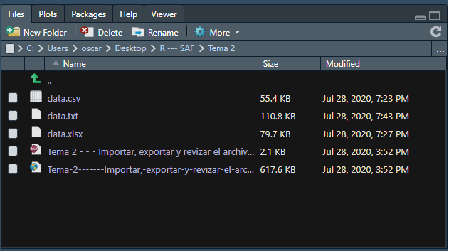

Existen dos principales formas de exportar los datos: mediante el uso de la función adecuada, o utilizando el ide de R-Studio lo cual guía al usuario en el proces de importación.

### Importación mediante código

Existen diversas extensiones de archivos de datos que podríamos querer importar:

- .xlsx / .xls
- .csv
- .txt
- .json
- .dat
- .sav
- .sas

Y la lista podría ser bastante más extensa. Nos enfocaremos en los dos principaeles: .xlsx y .csx

#### Importación de los archivos de Excel.

En la importación de este tipo de archivos, utilizaremos la función "read_excel()". Para esto, debemos primeramente utilizar el paquete "readxl", utilizando la fución de library:

```{r}
library(readxl)
data <- read_excel("data.xlsx")

```

Una vez compilado, verán que en la pestaña de "Enviroment" se creó un nuevo archivo que se llama "data", el cual contiene 1000 observaciones y 13 variables.


El archivo de datos podemos verlo de dos formas: haciendo"click" en el simbolo de una hoja cuadriculada a la derecha, o mediante la función "View".

```{r}
View(data)
```

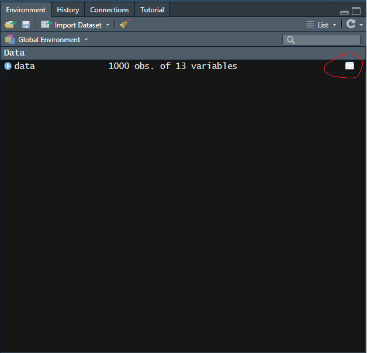

En las importaciones, así como en la gran mayoría de funciones, es adecuado ver su composición en términos de los argumentos que esta podría recibir. Veamos un poco esto:

https://www.rdocumentation.org/packages/readxl/versions/1.3.1/topics/read_excel

```{r eval = FALSE}
 read_excel(path, sheet = NULL, range = NULL, col_names = TRUE,
 col_types = NULL, na = "", trim_ws = TRUE, skip = 0,
  n_max = Inf, guess_max = min(1000, n_max),
 progress = readxl_progress(), .name_repair = "unique")
```

Vemos que si no hubieramos elegido el director, podríamos señalar directamente la ubicación, también se podría especificar la hoja de trabajo, si tomamos o no los nombres de columna, si saltamos unas "n" líneas en la importación, así como otro montón de opciones que nos permite flexibilizar el proceso de importación

#### Importación de los archivos .csv

En la importación de este tipo de archivos, utilizaremos la función "read_delim()". Para esto, debemos primeramente utilizar el paquete "readr", utilizando la fución de library():

```{r}
library(readr)
data2 <- read_delim("data2.csv", ";", escape_double = FALSE, 
    trim_ws = TRUE)
```

Veamos los datos:

```{r}
View(data2)
```

Según el código expuesto, vemos que se incorporaron 3 nuevos argumentos. ¿Cuáles fueron estos?

Al igual que antes, veamos la estructura de la función read_delim():

https://www.rdocumentation.org/packages/readr/versions/1.3.1/topics/read_delim

```{r eval = FALSE}
 read_delim(file, delim, quote = "\"", escape_backslash = FALSE,
  escape_double = TRUE, col_names = TRUE, col_types = NULL,
  locale = default_locale(), na = c("", "NA"), quoted_na = TRUE,
  comment = "", trim_ws = FALSE, skip = 0, n_max = Inf,
  guess_max = min(1000, n_max), progress = show_progress(),
  skip_empty_rows = TRUE)
```

¿Qué significan los argumentos de la función  read_delim() que utilizamos? 

### Importación por medio del ide de R-Studio

Para importar el archivo  **data** con extensión .xlsx, en R-Studio vamos a: **File --> Import Dataset --> From Excel...**

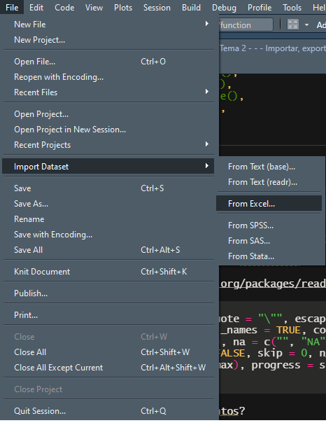

Para importar el archivo de data con extensión .csv, en R-Studio vamos a: **File --> Import Dataset --> From readr...**

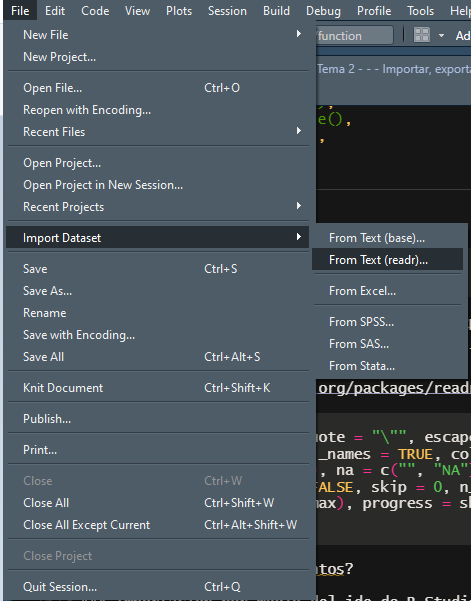


Cuando importarmos un archivo de Excel mediante esta modalidad, habiendo seleccionado el archivo que nos interesa, se nos despliega la siguiente ventana:

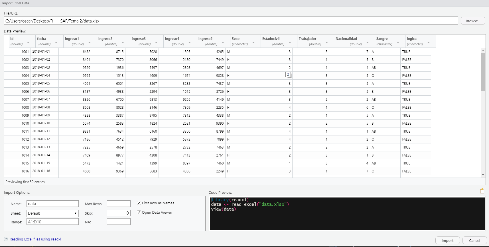
Vemos que en el proceso de importación, podemos elegir diversas opciones: nombre del archivo, máximo de líneas, hoja de trabajo, saltar líneas al inicio, el rango de la hoja y el tratamiento que podrían tener los *NA*.

Cuando importarmos un archivo de .csv mediante esta modalidad,habiendo seleccionado el archivo que nos interesa, se nos despliega la siguiente ventana:

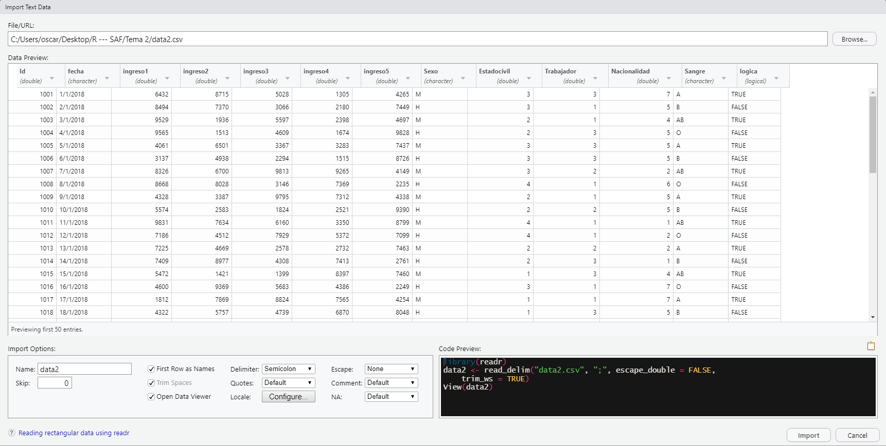
Esta ventana ofrece también otras características de importación. Es muy problable que la más importantes de todas sea el separar de campo que debamos elegir. 

En ambos caso, importamos el archivo al presionar el botón de *Import*.

### ¿Cuál debemos utilizar?


Realmente, esto depende del proceso y el grado del dominio de una determinada función. 

- Si se está iniciando en R, será más recomendable el método de importación mediante el ide.
- Si se tiene un proceso estable y automatizado, será mejor optar la utilización de código.

En un inicio, será recomendable manipular ambas opciones. 

### Otras extensiones y funciones

En este caso vimos únicamente importar archivos tipo **.xlsx** y **.csv**, sin embargo, se podrían exportar archivos **.txt**, **.pdf**, **.dta** entre montón de extensiones que el sistema R y sus librerías así lo soporten.

De igual forma, para importar un tipo de archivo, no existe únicamente las funciones mencionadas. Por ejemplo, para importar un archivo .csv se podrían utilizar las funciones read_csv o read_csv2.

Una librería que recomiendo para la importación, pertendenciente a la familia *Tidyverse*, es **readr**:


Mediante esta librería se puede importar los principales archivos estructurados. Las funciones disponibles son:

- Comma Delimited Files: read_csv() 
- Semi-colon Delimited Files: read_csv2()
- Files with Any Delimiter: read_delim()
- Fixed Width Files: read_fwf()
- Tab Delimited Files : read_tsv

También posee importación y lectura de datos para formatos no tabulares:

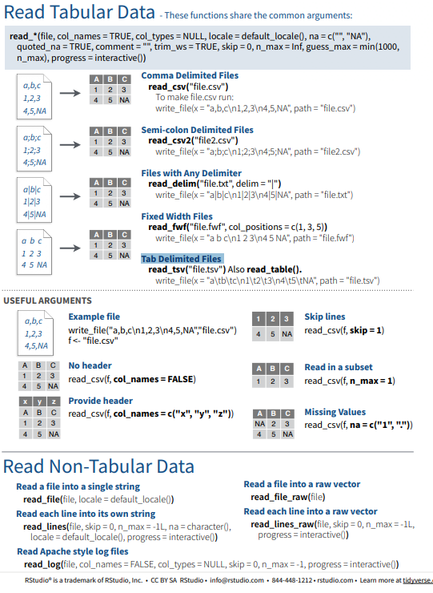

Pueden consultar el siguiente enlace: https://rawgit.com/rstudio/cheatsheets/master/data-import.pdf

#### Grandes volúmenes de datos. 

En el crecimiento de R, conviente conocer diversos a la hora de realizar la lectura e importación de los archivos. Un trato de especial atención reciben los grandes archivos de datos (un archivo con gigas de almanecamiento). R ofrece ofrece diversas opciones para tratar los grandes volumenes de datos:

- data.table
- fred
- Spark (Big Data)
- tibble

En el curso solamente hablaremos del archivo tibble, el cuál está muy lejos de manejar estructuras de Big Data como así lo hace spark.

## Estructura archivo de dato  {.tabset .tabset-fade .tabset-pills}


### Estructuras de archivos más utilizados

Como bien se mencionó en el tema 1, las estructuras de análisis más comunes en R son:

- data.frame
- data.table
- tibble 

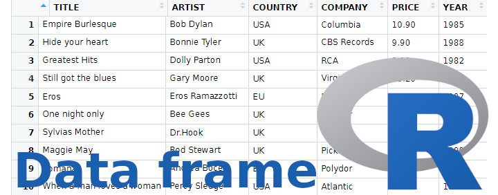

#### Un data.frame

Un marco de datos (data.frame) es una tabla o una estructura bidimensional similar a una matriz en la que cada columna contiene valores de una variable y cada fila contiene un conjunto de valores de cada columna. ... Los datos almacenados en un marco de datos pueden ser de tipo numérico, factorial o de carácter. El data.frame es una de las primera estructuras de datos creadas en R para almazenar la información.


#### Un data.table

Un **data.table** es una extensión del data.frame con diversas mejoras. Se usa ampliamente para la agregación rápida de grandes conjuntos de datos, agregar / actualizar / eliminar columnas de baja latencia, combinaciones ordenadas más rápidas y un lector de archivos rápido. ... Es un paquete ideal para la entrega de conjuntos de datos en R. Además es más versatil para fuciones dedicadas a los carácteres.


#### Un tibble

El objeto tbl_df es también un marco de datos que proporciona un método de impresión más agradable, útil cuando se trabaja con grandes conjuntos de datos. Los Tibbles son marcos de datos que son vagos (*lazy*) y hoscos (*surly*): hacen menos (es decir, no cambian los nombres o tipos de variables, y no hacen coincidencias parciales) y se quejan más (por ejemplo, cuando una variable no existe). Esto permite mejorar las estructuras de los datos.

Hay dos diferencias principales en el uso de un marco de datos frente a un tibble: impresión y subconjunto. Tibbles tiene un método de impresión refinado que muestra solo las primeras 10 filas y todas las columnas que caben en la pantalla. Esto hace que sea mucho más fácil trabajar con datos grandes.

Para más referencias sobre tibble: https://tibble.tidyverse.org/

### Inspección general del archivo de datos

Importados los datos, conviene hacer una inspección a estos. La inspección se puede hacer a nivel *macro* o general, o a nivel *micro*, yendo a ver casos específicos de interés. 

Veamos ambos casos.


En la inspección general podemos querer saber sobre la estructura general de los datos, la dimensión de los datos, entre otros detalle de interés.

Veamos esto:

#### La estructura: srt()

```{r}
str(data)
```

¿Qué es lo que la función **srt()** nos permite saber?

#### La dimensión: dim()

```{r}
dim(data)
```

¿Qué hace la función **dim()**?

#### Número de líneas: nrow()

```{r}
nrow(data)
```

#### Número de filas: ncol()

```{r}
ncol(data)
```

#### Nombre de las variables: names

A criterio personal, la función más utilizada sobre aspector generales del archivo de datos.

```{r}
names(data)
```

### Inspección especifica del archivo de datos

Podría ser que nos intere conocer y visualizar más los datos, así como ubicarlos dentro del archivo. 

Veamos un poco esto.

#### Tipo de informacion 

##### Clase del archivo de datos

```{r}
class(data)
```

##### Clase de las variables en el archivo de datos 

```{r}
class(data$Id)
class(data$fecha)
class(data$ingreso1)
class(data$ingreso2)
class(data$Sexo)
class(data$Estadocivil)
class(data$Trabajador)
class(data$Nacionalidad)
class(data$Sangre)
class(data$logica)
```

#### Lectura de líneas y columnas: indexación

#### Lectura de las líneas

```{r}
data[1,]
data[c(1,2),]
data[c(1:10),]

```

#### Lectura de las columnas

```{r}
data[,1]
data[,c(1,2)]
data[,c(1:10)]

data[,-1]
data[,c(-1:-3)]

data[,"ingreso1"]
data[,c("ingreso1","ingreso2","ingreso3")]
```

#### Lectura conjunta de líneas y columnas 

```{r}
data[1,1]
data[1:10,c(1,2)]


data[,-1]
data[,c(-1:-3)]

data[1-10,"ingreso1"]
data[1-50,c("ingreso1","ingreso2","ingreso3")]
```

### Otro tipo de estructuras de datos

Si abrimos el archivo data, veremos lo siguiente:

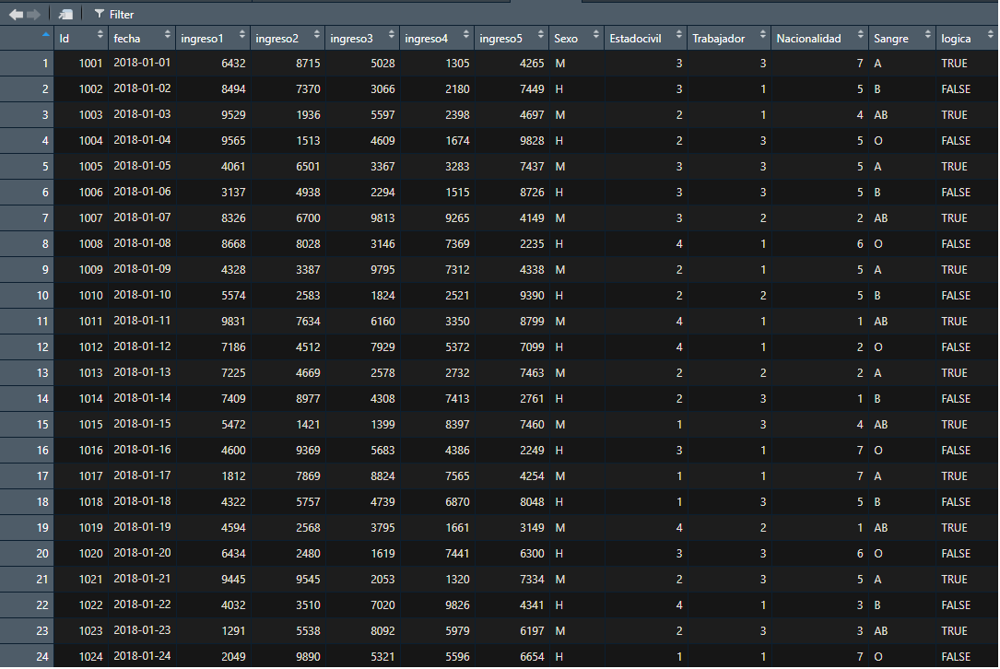

Vemos que las variables están en las columnas, y el número de filas representan los casos u observaciones.

Sin embargo, existen otras estructuras de datos. Veamos el siguiente ejemplo referido a datos en el tiempo.

```{r echo=FALSE, message=FALSE,warning=FALSE}

Dataset_Danta <- read_csv("Dataset Danta.csv", 
                                  col_types = cols(Date = col_date(format = "%Y-%m-%d"), 
                                      Holidays = col_character()))
library(xts)
library(dplyr)

datos_xts <- xts(x = Dataset_Danta[,c(-1)],
                  order.by = seq(as.Date("2013-01-01"), 
                            length = 943, 
                            by = "days"))
```

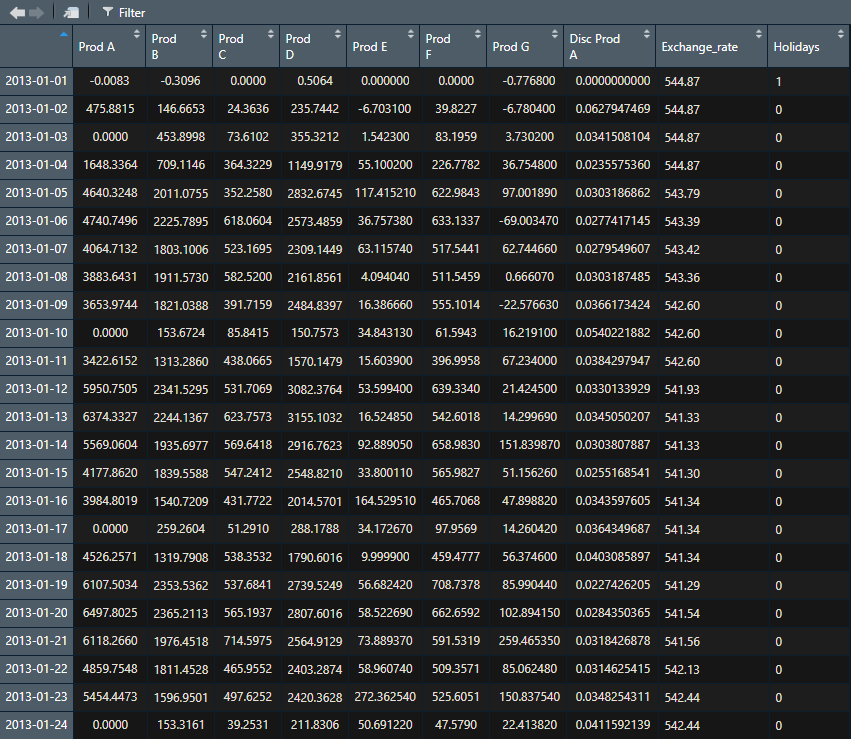

Vemos que acá las filas no son observaciones, sino fechas. Por lo tanto, dependiendo del tipo de análisis que vayamos a realizar se va a preferir una u otra estructura de datos.

Finalmente, las filas podrían tener los casos de análisis con sus nombre. Veamos el archivo de *mtcars*:

```{r}
View(mtcars)
```

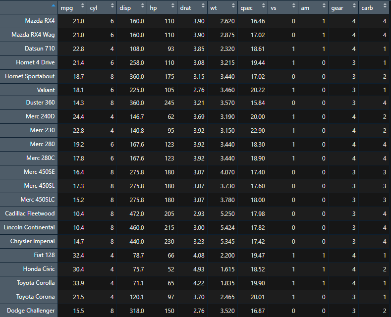

En R podemos tener diversos formatos de estructuras de archivos de datos.

##  La exportación o salvar una estructura de datos {.tabset .tabset-fade .tabset-pills}


Finalmente veamos como exportamos archivos de R segun diversas extensión.

### Exportando un archivo .xlsx

Para esto utilizamos la librería "writexl"

```{r}
library(writexl)
```

Y utilizamos la función write_xlsx(), donde el 1er argumento sería el archivo de datos, y el 2nd el nombre la extensión entre ""

```{r}
write_xlsx(data, "export1.xlsx")
```

Verifiquen que el archuvi export1 está en el directorio de trabajo.


### Exportando un archivo .csv

Utilizamos la función write.csv(), donde el 1er argumento sería el archivo de datos, y el 2nd el nombre la extensión entre ""

```{r}
write_xlsx(data, "export2.csv")
```

### Otras extensiones

Tanto para importaciones y exportaciones, podemos exportar los datos practicamente en cualquier tipo de extensión. 

La librería *readr* permite exportar o salvar una estructura de datos en diferentes modalidades:

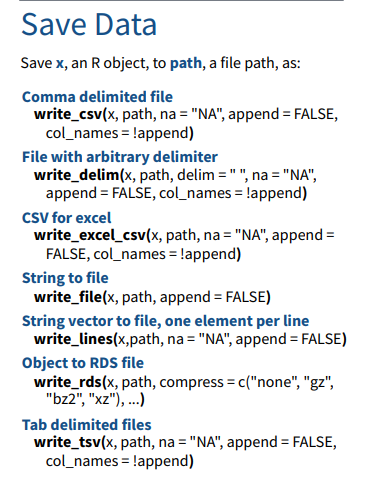

- Formato .csv delimitado por comas --> write_csv(x, path, na = "NA", append = FALSE, col_names = !append) 
- Formato libre o .txt (formato libre) delimitado por un delimitador arbitrario --> write_delim(x, path, delim = " ", na = "NA", append = FALSE, col_names = !append)
- Formato .csv para ser leido en Excel -->  write_excel_csv(x, path, na = "NA", append = FALSE, col_names = !append)
- Formato **String to file** -->  write_file(x, path, append = FALSE)
- Formato **String vector to file, one element per line** --> write_lines(x,path, na = "NA", append = FALSE)
- Formato de un objeto a un archivo RDS --> write_rds(x, path, compress = c("none", "gz","bz2", "xz"), ...)
- Formato delimitado por Tab o espaciamientos largos --> write_tsv(x, path, na = "NA", append = FALSE, col_names = !append)


